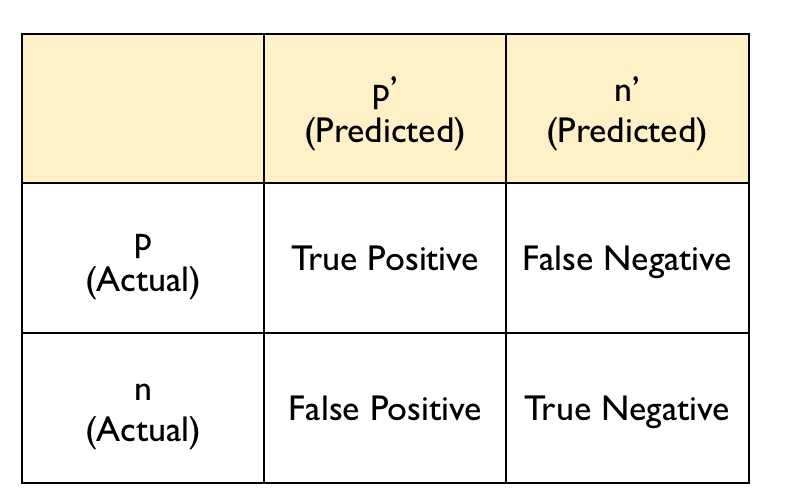
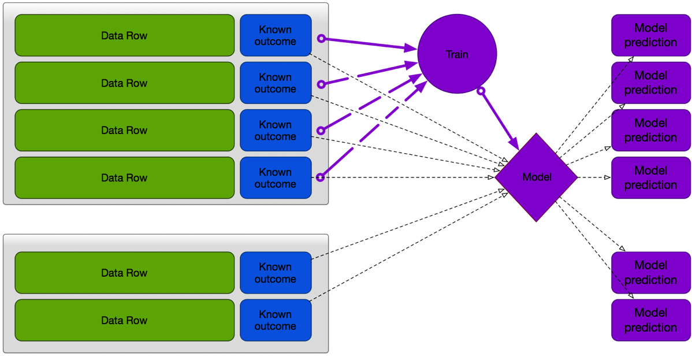
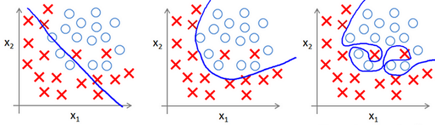
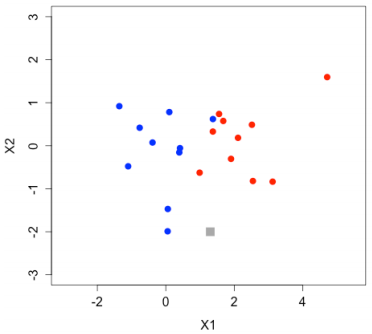
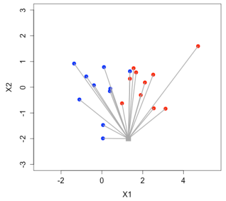
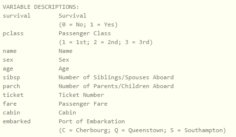

# 大綱

- 機器學習
- k最近鄰分類法(k-Nearest Neighbors, KNN)
- 衡量指標
- 訓練與測試資料集
- Underfitting vs. Overfitting
- 實作範例

# 機器學習

* 機器學習的特性
	* 判讀過往資料的特徵，去對未知資料做預測
	* 歷史資料愈豐富，模型的表現應該要愈好


* 大家怎麼認得一棵樹？


經過過去的一些**標準答案**來學習的

* 在你大腦中可能有這樣的過程

|紅色比例|綠色比例|藍色比例|答案|
|--------|--------|--------|----|
|0.1|0.9|0.0|樹|
|0.8|0.2|0.0|花|
|0.0|0.1|0.9|海|
|0.1|0.9|0.0|？|


# 好的機器學習模型

一個好的機器學習模型大致上具有這幾個特性：

* 準確度高
* 計算時間短(2007 Netflix Prize)
* 可以適用到未知資料

# 分類

* 監督式學習

有個大頭貼照，我要判斷他是男生還是女生，每一張照片給機器學習的時候，會讓機器知道每張照片的**正確答案**(男生or女生)，機器學完以後，會產生一個model，之後機器會用他學出來的model來判斷新的照片是男生還是女生

* 目標：預測新資料的**類別**
* 利用歷史資料建立出分類器
* 利用分類器預測新資料所屬類別
* 分類器：k最近鄰分類法(k-Nearest Neighbors, KNN)

# 分類的特性

* 依據已知的資料對未知的資料做預測分類
* 一個人整體平均而言是開心還是不開心？
    * 數值型變數
        * 身高
        * 體重
        * 年收入
        * 年紀
        * ...
    * 類別型變數
        * 感情狀態
        * 出生地
        * 有無運動習慣
        * 有無房
        * 有無車
        * ...

# 基本機器學習模型的對應衡量指標

|機器學習模型|衡量表現指標|
|------------|------------|
|分類(Classification)|混淆矩陣Confusion Matrix|


# 混淆矩陣Confusion Matrix

* 以二元分類器為例：



* 有很多的衡量指標由混淆矩陣衍生而來：

$$Accuracy = \frac{TP + TN}{TP + FP + FN + TN}$$

* 但光使用 Accuracy 來判定會有什麼問題？
* 假設現在有一個所謂的罕見疾病，存在比例大約是1%
* 我們有一個預測罕見疾病的分類器，很粗糙，它一律猜測所有觀測值(病人)都是正常的：

|     |TRUE|FALSE|
|-----|----|-----|
|TRUE |990 |0    |
|FALSE|10  |0    |

$$Accuracy = \frac{990 + 0}{990 + 10 + 0 + 0} = 0.99$$


* 因此關於混淆矩陣我們還有[其他的指標](http://www.gss.com.tw/index.php/focus/eis/157-eis82/1540-eis82-2)：

$$TPR = \frac{TP}{TP + FN}$$

$$FPR = \frac{FP}{FP + TN}$$


# 訓練與測試

* 實務上我們要將資料分為**訓練(training)**與**測試(test)**
* 這兩組資料不重疊
* 建議比例為70%與30%



# Underfitting vs. Overfitting

* 你是否常常聽到人家說underfitting或overfitting？




* 在**適用性**與**精確性**之間取得良好的平衡

# Underfitting vs. Overfitting？ - overfitting的狀況

* 我們的分類器overfitting(對訓練資料集的分類完全正確，accuracy = 100%)
* 但是對測試資料集的分類accuracy僅有62.5%

```{r}
# 倒帳資料集
debtIncomeRatio <- c(1, 2.112, 4.123, 1.863, 2.973, 1.687, 5.891, 3.167, 1.23, 2.441, 3.555, 3.25, 1.333)
default <- c(0, 0, 1, 0, 1, 0, 1, 0, 0, 1, 0, 0, 1)
defaultDataTrain <- data.frame(debtIncomeRatio, default)
defaultDataTrain$default <- factor(defaultDataTrain$default)

# 分類器
default_classifier <- function(x){
  prediction <- rep(NA, length(x))
  prediction[x > 4] <- 1
  prediction[x >= 3 & x <= 4] <- 0
  prediction[x >= 2.2 & x < 3] <- 1
  prediction[x >= 1.4 & x < 2.2] <- 0
  prediction[x > 1.25 & x < 1.4] <- 1
  prediction[x <= 1.25] <- 0
  return(prediction)
}

# training資料集的accuracy
defaultPredictionOverTrain <- default_classifier(defaultDataTrain$debtIncomeRatio)
confusionMatrixOverTrain <- table(defaultDataTrain$default, defaultPredictionOverTrain)
accuracyOverTrain <- sum(diag(confusionMatrixOverTrain)) / sum(confusionMatrixOverTrain)
accuracyOverTrain

# test資料集
debtIncomeRatio <- c(1.5, 	4.941, 	3.429, 	3.493, 	3.38, 	3.689, 	1, 	6.761, 	2.195, 	2.857, 	1.883, 	1.744, 	2.325, 	1.25, 	1.8, 	2.5, 	4.617, 	2.206, 	8.323, 	3.764, 	1.932, 	3.153, 	1.983, 	3.812, 	4.295, 	4.5, 	1.3, 	1, 	5.009, 	5.888, 	1, 	3.456, 	3.379, 	1.755, 	2.333, 	2.188, 	1.406, 	1.857, 	3.707, 	3.766, 	2.93, 	2.076, 	1.9, 	1.684, 	2.769, 	4.571, 	3.029, 	3.628)
default <- c(0, 	1, 	1, 	1, 	0, 	1, 	0, 	1, 	1, 	0, 	0, 	0, 	0, 	0, 	1, 	0, 	1, 	0, 	1, 	0, 	0, 	0, 	0, 	1, 	0, 	1, 	0, 	0, 	1, 	0, 	0, 	1, 	0, 	0, 	0, 	0, 	0, 	0, 	1, 	0, 	1, 	0, 	0, 	1, 	1, 	0, 	0, 	0)
defaultDataTest <- data.frame(debtIncomeRatio, default)
defaultDataTest$default <- as.factor(defaultDataTest$default)

# test資料集的accuracy
defaultPredictionOverTest <- default_classifier(defaultDataTest$debtIncomeRatio)
confusionMatrixOverTest <- table(defaultDataTest$default, defaultPredictionOverTest)
accuracyOverTest <- sum(diag(confusionMatrixOverTest)) / sum(confusionMatrixOverTest)
accuracyOverTest
```

# Underfitting vs. Overfitting？

* 用新的分類器對**訓練**資料分類並計算accuracy
* 用新的分類器對**測試**資料分類並計算accuracy
* 跟前面的例子比較一下

```{r}
# 新的分類器
default_classifier <- function(x){
  prediction <- rep(NA, length(x))
  prediction[x > 4] <- 1
  prediction[x <= 4] <- 0
  return(prediction)
}

# training資料集的accuracy
defaultPredictionTrain <- default_classifier(defaultDataTrain$debtIncomeRatio)
confusionMatrixTrain <- table(defaultDataTrain$default, defaultPredictionTrain)
accuracyTrain <- sum(diag(confusionMatrixTrain)) / sum(confusionMatrixTrain)
accuracyTrain

# test資料集的accuracy
defaultPredictionTest <- default_classifier(defaultDataTest$debtIncomeRatio)
confusionMatrixTest <- table(defaultDataTest$default, defaultPredictionTest)
accuracyTest <- sum(diag(confusionMatrixTest)) / sum(confusionMatrixTest)
accuracyTest

```


# k最近鄰分類法(k-Nearest Neighbors)

* 用一個二元分類的圖例說明
* k = 1





* 如果 k = 5 就會從最近的 5 個點中，哪個顏色較多，來幫你決定新的資料點屬於什麼顏色，所以 k-nn 的 k 應該是一個奇數

* 計算距離的方式常見有兩種：
    * 歐幾里得距離(Euclidean Distance)
    * 曼哈頓距離(Manhattan Distance)

$$d_E(a, b) = \sqrt {\sum_{i=1} ^ D (a_i - b_i) ^ 2}$$
$$d_M(a, b) = \sum_{i = 1} ^ D \vert{a_i - b_i}\vert$$


# 單位標準化

* 既然這個演算法使用距離作分類, 我們必須對這些變數的單位進行**標準化**

height(m) |weight(kg)
--------- |----------
1.92      |92       
1.92      |91       
2.03      |92       


height(cm)|weight(kg)
----------|----------
192       |92        
192       |91        
203       |92        


* 標準化公式

    * Min Max Method

$$\frac{x - min(x)}{max(x) - min(x)}$$


# 實作範例 - titanic資料集

* titanic資料集的欄位說明



* 了解titanic資料結構
```{r}
titanic <- read.csv("D:/我的文件/國立台北護理健康大學/資管研一/資訊科學概論/classification/data/train.csv", header = TRUE)
str(titanic)
```

# k最近鄰分類法(k-Nearest Neighbors) - titanic資料集

* `knn()` 函數我們主要使用 4 個參數：
    * `train`
    * `test`
    * `cl`
    * `k`

```{r}
library(magrittr)
titanic <- read.csv("D:/我的文件/國立台北護理健康大學/資管研一/資訊科學概論/classification/data/train.csv", header = TRUE)
titanic <- titanic[, -c(1, 4, 5, 9, 11, 12)] %>% na.omit
titanic$Survived <- factor(titanic$Survived, levels = c("1", "0"))

# 標準化Pclass
minPclass <- min(titanic$Pclass)
maxPclass <- max(titanic$Pclass)
titanic$Pclass <- (titanic$Pclass - minPclass) / (maxPclass - minPclass)

# 標準化Age
minAge <- min(titanic$Age)
maxAge <- max(titanic$Age)
titanic$Age <- (titanic$Age - minAge) / (maxAge - minAge)

# 標準化SibSp
minSibSp <- min(titanic$SibSp)
maxSibSp <- max(titanic$SibSp)
titanic$SibSp <- (titanic$SibSp - minSibSp) / (maxSibSp - minSibSp)

# 標準化Parch
minParch <- min(titanic$Parch)
maxParch <- max(titanic$Parch)
titanic$Parch <- (titanic$Parch - minParch) / (maxParch - minParch)

# 標準化Fare
minFare<- min(titanic$Fare)
maxFare <- max(titanic$Fare)
titanic$Fare <- (titanic$Fare - minFare) / (maxFare - minFare)

# 洗牌
n <- nrow(titanic)
set.seed(123)
shuffledTitanic <- titanic[sample(n), ]

# 依照70%:30%的比例切分training與test
shuffledTitanic <- titanic[sample(n), ]
trainIndices <- 1:round(0.7 * n)
train <- shuffledTitanic[trainIndices, ]
testIndices <- (round(0.7 * n) + 1):n
test <- shuffledTitanic[testIndices, ]

# 先將標準答案獨立出來
trainLabels <- train$Survived
testLabels <- test$Survived

# 獨立預測變數
knnTrain <- train[, -c(1)]
knnTest <- test[, -c(1)]

# 建立模型
library(class)
set.seed(123)
pred <- knn(train=knnTrain, test=knnTest, cl=trainLabels, k=5)

# test資料集標準答案
testLabels
# test資料集的predict
pred

# 建立混淆矩陣並將accuracy計算印出
confusionMatrix <- table(testLabels, pred, dnn = c("Actual", "Predicted"))
confusionMatrix
accuracy <- sum(diag(confusionMatrix)) / sum(confusionMatrix)
accuracy

```


# 參考資料
https://github.com/yaojenkuo

